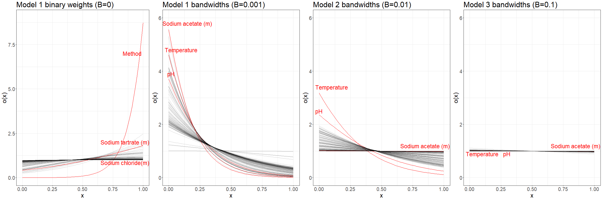
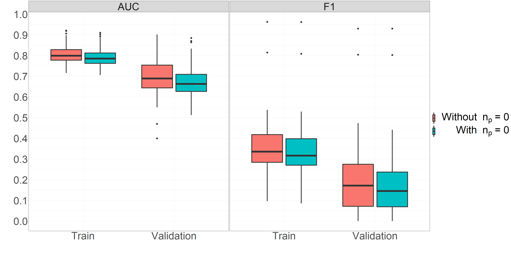
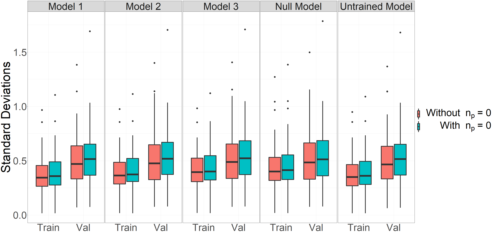
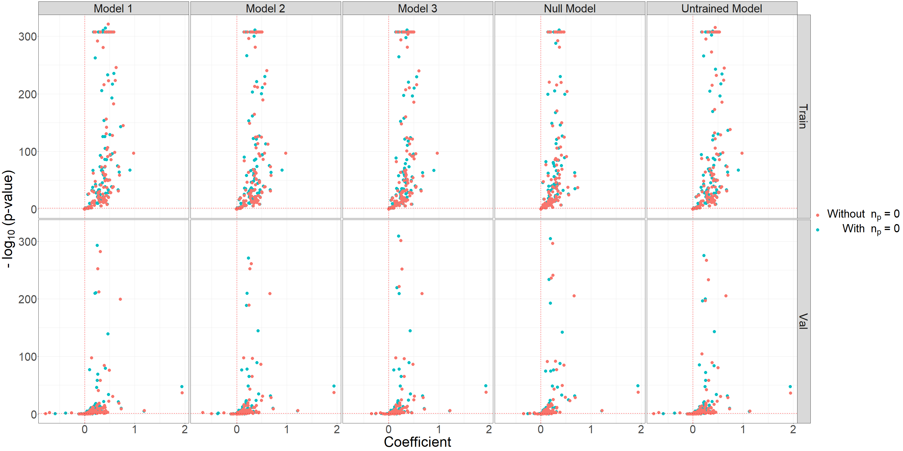
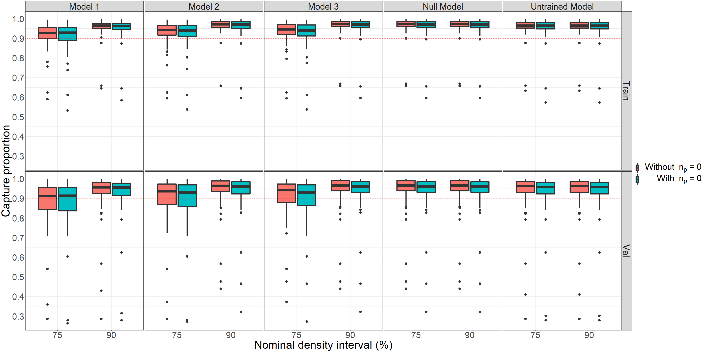

# SPreCC
**S**imilarity-based **Pre**diction of **C**rystallization **C**onditions

## Overview

Knowledge of the three-dimensional structure of a protein is important for understanding and influencing its biological functions.  The most common technique for determining the structure of a protein is X-ray crystallography, but obtaining high quality crystals for X-ray diffraction remains the bottleneck of this technique.  Predicting chemical conditions that would produce high quality crystals from the amino acid sequence of a protein would considerably speed up this process.  Previous efforts have attempted to [determine the optimal pH for crystallization from a protein's pI](https://doi.org/10.1093%2Fbioinformatics%2Fbtv011), [predict a list of chemical conditions](https://mlcb.github.io/mlcb2019_proceedings/papers/paper_3.pdf) for crystallization from a protein's amino acid sequence, or [predict the crystallization outcome from a set of chemical conditions](https://doi.org/10.1016/S1047-8477(03)00050-9) on a small (single-protein) scale.  However, to our knowledge, no attempt has been made to predict the optimal technique, pH, temperature, chemical conditions, and concentrations of those chemical conditions all together solely from a protein's amino acid sequence.  Here, we present and evaluate SPreCC, a method of predicting categorical, continuous, and presence/absence information for crystallization experiments based on amino acid sequence similarity.

## Table of Contents  
* [Models](#models)
* [Data Curation](#data-curation)
* [Results](#results)
* [Authors and Acknowledgements](#authors-and-acknowledgements)

## Models

We will present four models for different types of crystallization information.  The first will be a model for predicting the presence/absence status of chemical conditions such as sodium chloride or tris.  The second will be a model for predicting categorical values, which will be applied to predicting the optimal crystallization technique.  The third will be a model for predicting continuous variables like the molarity of sodium chloride, the percent volume per volume of dimethyl sulfoxide, or the pH.  The fourth will be a model for simultaneously predicting concentrations and polymer lengths for chemical conditions like polyethylene glycol (PEG).  A single condition might use multiple models; for example, sodium chloride uses both the presence/absence model for predicting whether it should be in the crystallization mixture and the concentration model for predicting its optimal concentration if it is present.  Sequence similarities will be determined using [Mash](https://mash.readthedocs.io/en/latest/index.html), and "the database" will refer to proteins in the train set (see [data curation](#data-curation)) with the relevant data available.

### Model 1 (presence/absence)

Let $y$ be the true binary value of the protein of interest (such as whether or not sodium chloride is present).  Let our prediction for the binary value be $\hat{y}$ such that 

$$\hat{y} = \frac{\bar{x}}{n_p+1} + \frac{n_p}{n_p+1}\cdot\frac{\sum\limits_{i} x_i\sigma(w_1s_i+w_0)}{\sum\limits_{i} \sigma(w_1s_i+w_0)} \textrm{ for } i \textrm{ such that } p_i<\tau$$

 where $x_i$ is the binary value for protein $i$ (e.g. whether sodium chloride was present for protein $i$), $s_i\in[0,1]$ is 1 minus the [Mash](https://mash.readthedocs.io/en/latest/index.html) distance between protein $i$ and the protein of interest, $\sigma$ is the [sigmoid function](https://en.wikipedia.org/wiki/Sigmoid_function), $p_i$ is the Mash p-value of the similarity between protein $i$ and the target protein (how likely the two proteins are to have their reported degree of similarity by chance), $\bar{x}$ is the average value of the binary variable across all the database, and $n_p$ is the total number of proteins with Mash p-values less than a threshold $\tau$.  Intuitively, we are taking a weighted average between the binary values from all the proteins and the binary values from related proteins.  This ensures that the model still gives an estimate for proteins with no similar proteins in the database while allowing predictions for proteins with even a few similar proteins to be mostly determined by the conditions of those similar proteins.  Within the term corresponding to similar proteins, $\sigma(w_1s_i+w_0)$ is the weight for the binary value of protein $i$, and the denominator normalizes the calculation.  Each weight should be some value between 0 and 1, and we expect greater sequence identities to correspond to heavier weights.  However, the model allows flexibility in how much some amount of additional sequence identity should increase the weight or whether it should increase the weight at all.  This weighting scheme allows much more flexibility and speed than, for example, incorporating the distance of every protein or ranking the most similar proteins.  By allowing a variable number of inputs, the model avoids a need for as many independent weights as there are proteins, and it allows the weight to be determined directly from the sequence similarity, likely a more relevant input than some ranked or positionally identified list.  We will attempt to minimize the negative log-likelihood loss with regularization: 

$$L(y,\hat{y}, \beta)=-[y\ln(\hat{y}) + (1-y)\ln(1-\hat{y})] + \beta||\boldsymbol{w}||^2$$

The specified model enables the fitting of two parameters: $w_0$ and $w_1$.  Let $\sigma_i=\sigma(w_1s_i+w_0)$.  Applying the chain rule, we obtain the following:

$$\begin{align*} 
\frac{\partial L(\hat{y},y,\beta)}{\partial w_0} &= \frac{\partial L(\hat{y},y,\beta)}{\partial \hat{y}} \cdot \frac{\partial \hat{y}}{\partial w_0} +2\beta w_0\\ 
&= -\left[\frac{y}{\hat{y}}-\frac{1-y}{1-\hat{y}}\right]\cdot \frac{\left(\sum\limits_{i}\sigma_i\right)\left(\sum\limits_{i}x_i\sigma_i(1-\sigma_i)\right)-\left(\sum\limits_{i}x_i\sigma_i\right)\left(\sum\limits_{i}\sigma_i(1-\sigma_i)\right)}{\left(\sum\limits_{i}\sigma_i\right)^2}+2\beta w_0\\
\frac{\partial L(\hat{y},y,\beta)}{\partial w_1} &=  \frac{\partial L(\hat{y},y,\beta)}{\partial \hat{y}} \cdot \frac{\partial \hat{y}}{\partial w_1}+2\beta w_1\\ 
&=  -\left[\frac{y}{\hat{y}}-\frac{1-y}{1-\hat{y}}\right]\cdot \frac{\left(\sum\limits_{i}\sigma_i\right)\left(\sum\limits_{i}x_i\sigma_i(1-\sigma_i)s_i\right)-\left(\sum\limits_{i}x_i\sigma_i\right)\left(\sum\limits_{i}\sigma_i(1-\sigma_i)s_i\right)}{\left(\sum\limits_{i}\sigma_i\right)^2}+2\beta w_1
\end{align*}$$

Because of the memory requirements involved in manipulating all the amino acid identity scores at once, we will use stochastic gradient descent to pick a protein at random, determine its amino acid identity against all the proteins in the database, predict its binary value, and update the weights according to the loss.  With a learning rate $\alpha$, the update statements will be as follows:

$$\begin{align*} 
w_0&\leftarrow w_0-\alpha\frac{\partial L(\hat{y},y)}{\partial w_0}\\
w_1&\leftarrow w_1-\alpha\frac{\partial L(\hat{y},y)}{\partial w_1}
\end{align*}$$

To achieve an initially plausible weight scheme, the following initializations will be used: $w_0=-1$, $w_1=3$.  The following plot shows the weights produced by these parameters over the range of possible sequence identities.

 
     
    <em>Plot 1: Initialization weights versus sequence identity for the presence/absence model.</em>

The learning rate will start as $\alpha=0.1$ and will decay by $1/((\textrm{number of proteins}) \cdot (\textrm{number of epochs}))$ after each update.  The Mash p-value threshold will be $\tau=1-(1-1/1000)^{1/\textrm{number of proteins}}\approx 10^{-8}$, a level chosen so that the probability of the target protein spuriously matching any protein in the database is less than 0.001.

### Model 2 (classification)

Let $y$ be the true multi-class value for the protein of interest (such as whether a protein requires vapor diffusion, lipidic cubic phase, etc.) where $y$ is a one-hot vector with each element representing one class.  Let our prediction for the multiclass value be $\hat{y}$ such that 

$$\hat{y} = \frac{\bar{x}}{n_p+1} + \frac{n_p}{n_p+1}\cdot\frac{\sum\limits_{i} x_i\sigma(w_1s_i+w_0)}{\sum\limits_{i} \sigma(w_1s_i+w_0)} \textrm{ for } i \textrm{ such that } p_i<\tau$$

 where $x_i$ is the one-hot encoded vector for protein $i$, $s_i\in[0,1]$ is 1 minus the Mash distance between protein $i$ and the protein of interest, $\sigma$ is the sigmoid function, $p_i$ is the Mash p-value of the similarity between protein $i$ and the target protein, $\bar{x}$ is the element-wise average of the one-hot encoded vectors across all the database, and $n_p$ is the total number of proteins with Mash p-values less than $\tau$.  Intuitively, we are taking a weighted average between the classes of all the proteins and the classes of related proteins.  This ensures that the model still predicts a class for proteins with no similar proteins in the database while also allowing predictions for proteins with even a few similar proteins to be mostly determined by the classes of those similar proteins.  Within the term corresponding to similar proteins, $\sigma(w_1s_i+w_0)$ is the weight for the class of protein $i$, and the denominator normalizes the calculation.  We will attempt to minimize the negative log-likelihood loss with regularization: 
 
$$L(y,\hat{y}, \beta)=-\sum_{k=1}^K y_k \ln (\hat{y}_k) + \beta||\boldsymbol{w}||^2$$ 

where $K$ is the number of classes.

The specified model enables the fitting of two parameters: $w_0$ and $w_1$.  Because of the loss specification, the gradient with respect to $w_0$ or $w_1$ will only pass through the chain rule with the $\hat{y}_k$ that corresponds to the correct $y_k$.  Let $\sigma_i=\sigma(w_1s_i+w_0)$.  Let $k$ be such that $y_k=1$.  Applying the chain rule, we obtain the following:

$$\begin{align*} 
\frac{\partial L(\hat{y},y,\beta)}{\partial w_0} &= \frac{\partial L(\hat{y},y,\beta)}{\partial \hat{y_k}} \cdot \frac{\partial \hat{y_k}}{\partial w_0}+2\beta w_0\\ 
&= -\left[\frac{1}{\hat{y_k}}\right]\cdot \frac{\left(\sum\limits_{i}\sigma_i\right)\left(\sum\limits_{i}x_{k,i}\sigma_i(1-\sigma_i)\right)-\left(\sum\limits_{i}x_{k,i}\sigma_i\right)\left(\sum\limits_{i}\sigma_i(1-\sigma_i)\right)}{\left(\sum\limits_{i}\sigma_i\right)^2}+2\beta w_0\\
\frac{\partial L(\hat{y},y,\beta)}{\partial w_1} &=  \frac{\partial L(\hat{y},y,\beta)}{\partial \hat{y_k}} \cdot \frac{\partial \hat{y_k}}{\partial w_1}+2\beta w_1\\ 
&=  -\left[\frac{1}{\hat{y_k}}\right]\cdot \frac{\left(\sum\limits_{i}\sigma_i\right)\left(\sum\limits_{i}x_{k,i}\sigma_i(1-\sigma_i)s_i\right)-\left(\sum\limits_{i}x_{k,i}\sigma_i\right)\left(\sum\limits_{i}\sigma_i(1-\sigma_i)s_i\right)}{\left(\sum\limits_{i}\sigma_i\right)^2}+2\beta w_1
\end{align*}$$

Because of the memory requirements involved in manipulating all the amino acid identity scores at once, we will use stochastic gradient descent to pick a protein at random, determine its amino acid identity against all the proteins in the database, predict its class, and update the weights according to the loss.  With a learning rate $\alpha$, the update statements will be as follows:

$$\begin{align*} 
w_0&\leftarrow w_0-\alpha\frac{\partial L(\hat{y},y)}{\partial w_0}\\
w_1&\leftarrow w_1-\alpha\frac{\partial L(\hat{y},y)}{\partial w_1}
\end{align*}$$

To achieve an initially plausible weight scheme, the following initializations will be used: $w_0=-1$, $w_1=3$.  The learning rate will start as $\alpha=0.1$ and will decay by $1/((\textrm{number of proteins}) \cdot (\textrm{number of epochs}))$ after each update.  The Mash p-value threshold will be $\tau=1-(1-1/1000)^{1/\textrm{number of proteins}}\approx 10^{-8}$.

### Model 3 (continuous, one variable)

Let $y$ be the true value for the continuous variable of the protein of interest (such as the concentration of sodium chloride).  We want to create a probability density function $f(\hat{y})$ that models the probability of the variable's true value being equal to some potential $\hat{y}$.  We want to maximize the probability assigned to some small interval around the value of the true value, $\int_{y(1-\delta)}^{y(1+\delta)}f(\hat{y})d\hat{y}$ for some small $\delta$, or, equivalently, we want to minimize the area of the fit density function that falls outside of that interval, $1-\int_{y(1-\delta)}^{y(1+\delta)}f(\hat{y})d\hat{y}$.  Because many of the variables are right skewed (and non-zero since the zero/non-zero case is dealt with by the presence/absence model), we use an interval with bounds multiplicatively rather than additively dependent on $y$.  The two exceptions are that pH and temperature will depend additively on $\delta$ since they are non-skewed and can be zero, but the model is otherwise equivalent.  This probability density can be created by applying a Gaussian kernel to a set of known values of the variable $\mathbf{x}$ from similar proteins.  With $x_i$ as the value of the crystallization variable for protein $i$, $p_i$ as the Mash p-value of the similarity between protein $i$ and the target protein, $h_i$ as the bandwidth of the kernel element for protein $i$, $n_p$ as the total number of proteins with Mash p-values less than $\tau$, $\bar{x}$ as the average of the variable of interest over all proteins in the database, and $\eta$ as the standard deviation of the variable of interest over all proteins in the database, this density function can be written as follows.

$$\begin{equation}
f(\hat{y})=\frac{1}{n_p+1}\frac{1}{\sqrt{2\pi}}\cdot\frac{1}{\eta}\exp\left[{-\frac{\left(\frac{\hat{y}-\bar{x}}{\eta}\right)^2}{2}}\right] + \frac{n_p}{n_p+1}\cdot\frac{1}{n_p\sqrt{2\pi}}\sum_{i}\frac{1}{h_i}\exp\left[{-\frac{\left(\frac{\hat{y}-x_i}{h_i}\right)^2}{2}}\right] \textrm{ for } i \textrm{ such that } p_i<\tau
\end{equation}$$

Intuitively, this is a kernel density estimate combining the distribution of the variable for all proteins and the distribution of the variable for only proteins similar to the protein of interest.  However, two issues arise: not all of these similar proteins are equally similar, so they should not be weighted equally, and the optimal bandwidth $h_i$ of each term is unknown.  Both of these issues can be solved simultaneously by allowing $h_i$ to be a function of $s_i$, the sequence identity (specifically, 1 minus the Mash distance between protein $i$ and the protein of interest).  This function should be continuous and likely decreasing on $[0,1]$ because more similar proteins likely should have a smaller bandwidth for their kernels.  Additionally, the function should have a codomain of $(0,\infty)$ because all the weights should be positive, but some could be much larger than others.  Therefore, the relationship between $h_i$ and $s_i$ will be given by 

$$\begin{equation}
h_i=\frac{c\sigma(w_1s_i+w_0)}{\int_0^1\sigma(w_1x+w_0)dx}=\frac{c\sigma(w_1s_i+w_0)}{\frac{\ln{(e^{-w_1}+e^{w_0})}-\ln(1+e^{w_0})}{w_1}+1}
\end{equation}$$

 where $\sigma$ is the sigmoid function and $c$ is a scaling value.  Letting $\mathbf{x}$ be the vector of values for similar proteins and $\mathbf{s}$ be the vector of sequence identities of the similar proteins, define the loss as 
 
 $$L(y, \mathbf{x}, \mathbf{s}, \bar{x}, \eta, \delta, \beta)=1-\int_{y(1-\delta)}^{y(1+\delta)}f(\hat{y})d\hat{y}+\beta(\eta-c)^2 + \beta||\boldsymbol{w}||^2$$
 
 with $f$ and $h_i$ as defined above.  We choose to regularize $c$ against $\eta$ because a naive bandwidth should be about the standard deviation of the variable's whole observed range, not 0.  In practice, letting $c$ vary often causes the model to break down because values of $x_i$ close to $y$ generate an extremely steep gradient for $c$, pushing $c$ very close to 0.  By creating extremely sharp peaks of density at each $x_i$, this undermines the effort to create a smooth probability density and makes numerical integration practically impossible.  Thus, we will fix $c$ at $\eta$.   While this forces the average bandwidth to be the standard deviation of the variable, the function is capable of becoming much larger near 0 than near 1, and protein similarities near 0 often do not pass the p-value threshold for inclusion.  Thus, in practice, bandwidths can become as small as necessary even with a fixed $c$.  Still, for generality, we will treat $c$ as a variable.

 (In the implementation, all values $y$ and $x$ of the variable will be divided by the database mean to account for the considerable differences in scale between variables while maintaining the general right skewedness and positive values.  When predicting values or ranges on the original scale, we can simply generate an estimate on this altered scale and multiply by the variable's mean.)

The specified model enables the fitting of three parameters: $w_0$, $w_1$, and $c$.  Let $h_i$ be as described above.  Let $\sigma_i=\sigma(w_1s_i+w_0)$.  Let $U$ be the $\sigma$ normalization term $\int_0^1\sigma(w_1x+w_0)dx=\frac{\ln{(e^{-w_1}+e^{w_0})}-\ln(1+e^{w_0})}{w_1}+1$.  Let $d_i=y-x_i$.  Let $z_i=\left(\frac{d_i}{h_i}\right)$.  Let $m = e^{w_0}+e^{-w_1}$.  Applying the chain rule, we obtain the following:

$$\begin{align*} 
\frac{\partial f(\hat{y})}{\partial w_0} &= \sum_i\frac{\partial f(\hat{y})}{\partial h_i}\frac{\partial h_i}{\partial w_0}\\
\frac{\partial f(\hat{y})}{\partial w_1} &= \sum_i\frac{\partial f(\hat{y})}{\partial h_i}\frac{\partial h_i}{\partial w_1}\\
\frac{\partial f(\hat{y})}{\partial c} &= \sum_i\frac{\partial f(\hat{y})}{\partial h_i}\frac{\partial h_i}{\partial c}\\
\frac{\partial f(\hat{y})}{\partial h_i} &= \frac{1}{(n_p+1)\sqrt{2\pi}}\frac{\exp({-z_i^2/2})(z_i^2-1)}{h_i^2}\\
\frac{\partial h_i}{\partial w_0} &= \frac{c\sigma_i(1-\sigma_i)}{U}-\frac{c\sigma_i(\frac{e^{w_0}}{m}-\frac{e^{w_0}}{1+e^{w_0}})}{w_1U^2}\\
\frac{\partial h_i}{\partial w_1} &= \frac{s_ic\sigma_i(1-\sigma_i)}{U}-\frac{c\sigma_i[\frac{-w_1e^{-w_1}}{e^{-w_1}+e^{w_0}} - (\ln(e^{-w_1}+e^{w_0})-\ln(1+e^{w_0}))]}{w_1^2U^2}\\
\frac{\partial h_i}{\partial c} &= \frac{h_i}{c}\\
\end{align*}$$

However, we are actually interested in the integrals of these quantities, which are obtained with the Leibniz integral rule:

$$\begin{equation}
\begin{aligned} 
\frac{\partial L(y, \mathbf{x}, \mathbf{s}, \bar{x}, \eta, \delta, \beta)}{\partial w_0} &= -\int_{y(1-\delta)}^{y(1+\delta)} \frac{\partial f(\hat{y})}{\partial w_0}d\hat{y}+2\beta w_0\\   
\frac{\partial L(y, \mathbf{x}, \mathbf{s}, \bar{x}, \eta, \delta, \beta)}{\partial w_1} &=  -\int_{y(1-\delta)}^{y(1+\delta)} \frac{\partial f(\hat{y})}{\partial w_1}d\hat{y}+2\beta w_1\\ 
\frac{\partial L(y, \mathbf{x}, \mathbf{s}, \bar{x}, \eta, \delta, \beta)}{\partial c} &=  -\int_{y(1-\delta)}^{y(1+\delta)} \frac{\partial f(\hat{y})}{\partial c}d\hat{y}+2\beta (c-\eta)\\
\end{aligned}
\end{equation}$$

Because of the memory requirements involved in manipulating all the amino acid identity scores at once, we will use stochastic gradient descent to pick a protein at random, determine its amino acid identity against the proteins in the database, compute its density function, and update the weights according to the loss.  With a learning rate $\alpha$, the update statements will be as follows:

$$\begin{equation}
\begin{aligned}
w_0&\leftarrow w_0-\alpha\frac{\partial L(y, \mathbf{x}, \mathbf{s}, \bar{x}, \eta, \delta, \beta)}{\partial w_0}\\
w_1&\leftarrow w_1-\alpha\frac{\partial L(y, \mathbf{x}, \mathbf{s}, \bar{x}, \eta, \delta, \beta)}{\partial w_1}\\
c&\leftarrow c-\alpha\frac{\partial L(y, \mathbf{x}, \mathbf{s}, \bar{x}, \eta, \delta, \beta)}{\partial c}
\end{aligned}
\end{equation}$$

The partial derivative of the density function with respect to each parameter will be computed exactly, but the Leibniz integrals will be approximated with a left Riemann sum and a $\Delta\hat{y}$ of $y/100$.

By linearity of expectation, the expectation of $f$ is simply $$\frac{1}{n_p+1}\bar{x}+\frac{n_p}{n_p+1}\frac{1}{n_p}\sum\limits_{i}x_i \textrm{ for } i \textrm{ such that } p_i<\tau$$

The mode of the distribution can be found by evaluating the probability density function (PDF) from $\min(\bar{x},\min(\{x_i|x_i\in\mathbf{x}\}))$ to $\max(\bar{x},\max(\{x_i|x_i\in\mathbf{x}\}))$ with a step size of the difference divided by 1,000 and recording the value of the variable at the maximum value of the PDF.  Because the density of an individual kernel input decreases on either side of its mean, the mode is guaranteed to be between these bounds.  Because numeric integration over a large sum of variables is computationally costly, we can find an estimated 95\% confidence interval from the 2.5th percentile to the 97.5th percentile of the kernel density by iterating from either end of the distribution.  For the 2.5th percentile, we begin iterating upwards from $\hat{y}=\max(\min(\textrm{value of the variable for all proteins in the database}),\min(\Phi^{-1}(0.025)\eta+\bar{x}, \{\min(\Phi^{-1}(0.025)h_i+x_i)|x_i\in\mathbf{x}\}))$ and taking steps of the same size as for the mode until 

$$\frac{1}{n_p+1}\Phi\left(\frac{\hat{y}-\bar{x}}{\eta}\right)+\frac{n_p}{n_p+1}\cdot\frac{1}{n_p}\sum_{i}\Phi\left(\frac{\hat{y}-x_i}{h_i}\right) \geq 0.025$$

with $\Phi$ denoting the standard normal cumulative density function.  We take this $\hat{y}$ as the 2.5th percentile.  Likewise, for the 97.5th percentile, we begin iterating downwards from $\hat{y}=\min(\max(\textrm{value of the variable for all proteins in the database}),\max(\Phi^{-1}(0.975)\eta+\bar{x},\max(\{\Phi^{-1}(0.975)h_i+x_i)|x_i\in\mathbf{x}\}))$ and taking steps of the same size until

$$\frac{1}{n_p+1}\Phi\left(\frac{\hat{y}-\bar{x}}{\eta}\right)+\frac{n_p}{n_p+1}\cdot\frac{1}{n_p}\sum_{i}\Phi\left(\frac{\hat{y}-x_i}{h_i}\right) < 0.975$$

We then take the $\hat{y}$ before the current one (the last one where the expression was greater than 0.975) as the 97.5th percentile.  As a proof sketch that the minimum of the kernel elements' 2.5th percentiles is less than or equal to the 2.5th percentile of the whole kernel density, consider that for any other term besides this minimizer, that term's 2.5th percentile must be larger by construction, so it contributes more density to the kernel above its own 2.5th percentile and therefore above the minimum 2.5th percentile than below either.  Therefore, this other term shifts the density of the total kernel density upwards, adding more weight above the minimum 2.5th percentile, guaranteeing that the overall 2.5th percentile is larger than the minimum of the individual kernel elements' 2.5th percentiles.  The proof for the 97.5th percentile is analogous. 
 Further bounding the search range by the minimum and maximum values of the variable in the database ensures that a protein with only a few distantly related proteins does not require a massive search space due to very large bandwidths in the kernel density.

To achieve an initially plausible bandwidth scheme, the following initializations will be used: $w_0=-1,$ $w_1=-2,$ $c=\eta$.  The following image shows the bandwidths produced by these parameters (with $\eta=1$) with more similar proteins having a lower bandwidth as expected.   

 
     
    <em>Plot 2: Initialization weights versus sequence identity for the continuous variable model.</em>

The learning rate will start as $\alpha=0.1$ and will decay by $1/((\textrm{number of proteins}) \cdot (\textrm{number of epochs}))$ after each update.  The Mash p-value threshold will be $\tau=1-(1-1/1000)^{1/\textrm{number of proteins}}\approx 10^{-8}$.

### Model 4 (continuous, two variables)

Let $(y_1,y_2)$ be the true value for the two-dimensional continuous variable of the protein of interest (such as the concentration and length of PEG).  We want to create a probability density function $f(\hat{y_1},\hat{y_2})$ that models the probability of the variable's true value being equal to some potential $(\hat{y_1},\hat{y_2})$.  We want to maximize the probability assigned to some small interval around the true value of the variable, $\int_{y_1(1-\delta)}^{y_1(1+\delta)}\int_{y_2(1-\delta)}^{y_2(1+\delta)}f(\hat{y_1},\hat{y_2})d\hat{y_1}d\hat{y_2}$ for some small $\delta$, or, equivalently, we want to minimize the area of the fit density function that falls outside of that interval, $1-\int_{y_1(1-\delta)}^{y_1(1+\delta)}\int_{y_2(1-\delta)}^{y_2(1+\delta)}f(\hat{y_1},\hat{y_2})d\hat{y_1}d\hat{y_2}$.  This probability density can be created by applying a Gaussian kernel to a set of known values of the variable $\mathbf{x}$ from similar proteins that contain the variable of interest.  With $(x_{1,i}, x_{2,i})$ as the value of the variable for protein $i$, $p_i$ as the Mash p-value of the similarity between protein $i$ and the target protein, $(h_{1,i}, h_{2,i})$ as the bandwidths of the kernel element for protein $i$, $n_p$ as the total number of proteins with Mash p-values less than $\tau$, $(\bar{x_1}, \bar{x_2})$ as the element-wise average of the variable of all proteins in the database, and $(\eta_1, \eta_2)$ as the standard deviations of the variable of all proteins in the database, this density function can be written as follows.

$$\begin{align*} 
\begin{split}
f(\hat{y_1},\hat{y_2})&=\frac{1}{n_p+1}\frac{1}{2\pi}\cdot\frac{1}{\eta_1\eta_2}\exp\left[{-\frac{\left(\frac{\hat{y_1}-\bar{x_1}}{\eta_1}\right)^2+\left(\frac{\hat{y_2}-\bar{x_2}}{\eta_2}\right)^2}{2}}\right]\\ 
&+ \frac{1}{n_p+1}\cdot\frac{1}{2\pi}\sum_{i}\frac{1}{h_{1,i}h_{2,i}}\exp\left[{-\frac{\left(\frac{\hat{y_1}-x_{1,i}}{h_{1,i}}\right)^2+\left(\frac{\hat{y_2}-x_{2,i}}{h_{2,i}}\right)^2}{2}}\right] \textrm{ for } i \textrm{ such that } p_i<\tau
\end{split}
\end{align*}$$

Intuitively, this is a kernel density estimate weighing together the distribution of the variable for all proteins and the distribution of the variable for only proteins similar to the protein of interest.  However, two issues arise: not all of these similar proteins are equally similar, so they should not be weighted equally, and the optimal bandwidths $(h_{1,i}, h_{2,i})$ of each term are unknown.  Both of these issues can be solved simultaneously by allowing $(h_{1,i}, h_{2,i})$ to be a function of $s_i$, the sequence identity (specifically, 1 minus the Mash distance between protein $i$ and the protein of interest).  This function should be continuous and decreasing on $[0,1]$ because more similar proteins likely should have a smaller bandwidth for their kernels.  Additionally, the function should have a codomain of $(0,\infty)$ because all the weights should be positive, but some could be much larger than others.  Therefore, the relationship between $(h_{1,i}, h_{2,i})$ and $s_i$ will be given by 

$$\begin{equation}
h_{j,i}=\frac{c_j\sigma(w_{j,1}s_i+w_{j,0})}{\int_0^1\sigma(w_{j,1}x+w_{j,0})dx}=\frac{c_j\sigma(w_{j,1}s_i+w_{j,0})}{\frac{\ln{(e^{-w_{j,1}}+e^{w_{j,0}})}-\ln(1+e^{w_{j,0}})}{w_{j,1}}+1}
\end{equation}$$

 for $j\in\{1,2\}$ where $\sigma$ is the sigmoid function and $c_j$ is a scaling value.  Letting $\mathbf{x}$ be the vector of values for similar proteins and $\mathbf{s}$ be the vector of sequence identities of the similar proteins, define the loss as 
 
 $$L((y_1,y_2), \mathbf{x}, \mathbf{s}, (\bar{x_1}, \bar{x_2}), (\eta_1,\eta_2), (\delta_1,\delta_2), \beta)=1-\int_{y_1(1-\delta)}^{y_1(1+\delta)}\int_{y_2(1-\delta)}^{y_2(1+\delta)}f(\hat{y_1},\hat{y_2})d\hat{y_1}d\hat{y_2}+\beta||\boldsymbol{\eta}-\mathbf{c}||^2 + \beta||\boldsymbol{w}||^2$$
 
 with $f$ and $(h_{1,i}, h_{2,i})$ as defined above.  We choose to regularize $\mathbf{c}$ against $\boldsymbol{\eta}$ because a naive bandwidth should be about the standard deviation of the variable, not 0.  In practice, letting $c_1$ and $c_2$ vary often causes the model to break down because values of $x_i$ close to $y$ generate an extremely steep gradient for $c_1$ and $c_2$, pushing them very close to 0.  By creating extremely sharp peaks of density at each $x_i$, this undermines the effort to create a smooth probability density and makes numerical integration essentially impossible.  Thus, we will fix $c_1$ and $c_2$ at $\eta_1$ and $\eta_2$ respectively.  While fixing these values forces the average bandwidth to be the standard deviation of all values for the variable, the function is capable of becoming much larger near 0 than near 1, and protein similarities near 0 often do not pass the p-value threshold for inclusion.  Thus, in practice, bandwidths can become as small as necessary even with fixed $c_1$ and $c_2$.  Still, for generality, we will treat both as variables.

 (As before, all values $y$ and $x$ of the variable will be divided elementwise by their means.)

The specified model enables the fitting of six parameters: $w_{1,0}$, $w_{1,1}$, $c_1$, $w_{2,0}$, $w_{2,1}$, and $c_2$.  Let $(h_{1,i}, h_{2,i})$ be as described above.  For $j\in\{1,2\}$, let $\sigma_{j,i}=\sigma(w_{j,1}s_i+w_{j,0})$.  Let $U_j$ be the $\sigma_j$ normalization term $\int_0^1\sigma(w_{j,1}x+w_{j,0})dx=\frac{\ln{(e^{-w_{j,1}}+e^{w_{j,0}})}-\ln(1+e^{w_{j,0}})}{w_{j,1}}+1$.  Let $d_{j,i}=y_j-x_{j,i}$.  Let $z_{j,i}=\left(\frac{d_{j,i}}{h_{j,i}}\right)$.  Let $m_j = e^{w_{j,0}}+e^{-w_{j,1}}$, $r_j=\frac{e^{w_{j,0}}}{m_j}-\frac{e^{w_{j,0}}}{1+e^{w_{j,0}}}$, $v_j=[\frac{-w_{j,1}e^{-w_{j,1}}}{m_j} - (\ln(m_j)-\ln(1+e^{w_{j,0}}))]/w_{j,1}$.  Applying the chain rule, we obtain the following:

$$\begin{align*}
\frac{\partial f(\hat{y_1},\hat{y_2})}{\partial w_{j,0}} &= \sum_i\frac{\partial f(\hat{y_1},\hat{y_2})}{\partial h_{j,i}}\frac{\partial h_{j,i}}{\partial w_{j,0}}\\
\frac{\partial f(\hat{y_1},\hat{y_2})}{\partial w_{j,1}} &= \sum_i\frac{\partial f(\hat{y_1},\hat{y_2})}{\partial h_{j,i}}\frac{\partial h_{j,i}}{\partial w_{j,1}}\\   
\frac{\partial f(\hat{y_1},\hat{y_2})}{\partial c_j} &= \sum_i\frac{\partial f(\hat{y_1},\hat{y_2})}{\partial h_{j,i}}\frac{\partial h_{j,i}}{\partial c_j}\\   
\frac{\partial f(\hat{y_1},\hat{y_2})}{\partial h_{1,i}} &= \frac{1}{(n_p+1)2\pi}\frac{\exp({-z_{2,i}^2/2})}{h_{2,i}}\frac{\exp({-z_{1,i}^2/2})(z_{1,i}^2-1)}{h_{1,i}^2}\\ 
\frac{\partial f(\hat{y_1},\hat{y_2})}{\partial h_{2,i}} &= \frac{1}{(n_p+1)2\pi}\frac{\exp({-z_{1,i}^2/2})}{h_{1,i}}\frac{\exp({-z_{2,i}^2/2})(z_{2,i}^2-1)}{h_{2,i}^2}\\
\partial h_{j,i}/\partial w_{j,0} &= [c_j\sigma_{j,i}(1-\sigma_{j,i})]/U_j-[c_j\sigma_{j,i}r_j]/[w_{j,1}(U_j)^2]\\
\partial h_{j,i}/\partial w_{j,1} &= [s_i\cdot c_j\sigma_{j,i}(1-\sigma_{j,i})]/U_j-[c_j\sigma_{j,i}v_j]/[w_{j,1}(U_j)^2]\\
\frac{\partial h_{j,i}}{\partial c_j} &= \frac{h_{j,i}}{c_j}\\
\end{align*}$$

However, we are actually interested in the integrals of these quantities, which are obtained with the Leibniz integral rule:

$$\begin{equation}
\begin{aligned} 
\frac{\partial L((y_1,y_2), \mathbf{x}, \mathbf{s}, (\bar{x_1}, \bar{x_2}), (\eta_1,\eta_2), (\delta_1,\delta_2), \beta)}{\partial w_{j,0}} &= -\int_{y_1(1-\delta)}^{y_1(1+\delta)}\int_{y_2(1-\delta)}^{y_2(1+\delta)}\frac{\partial f(\hat{y_1},\hat{y_2})}{\partial w_{j,0}}d\hat{y_1}d\hat{y_2}+2\beta w_{j,0}\\   
\frac{\partial L((y_1,y_2), \mathbf{x}, \mathbf{s}, (\bar{x_1}, \bar{x_2}), (\eta_1,\eta_2), (\delta_1,\delta_2), \beta)}{\partial w_{j,1}} &=  -\int_{y_1(1-\delta)}^{y_1(1+\delta)}\int_{y_2(1-\delta)}^{y_2(1+\delta)}\frac{\partial f(\hat{y_1},\hat{y_2})}{\partial w_{j,1}}d\hat{y_1}d\hat{y_2}+2\beta w_{j,1}\\ 
\frac{\partial L((y_1,y_2), \mathbf{x}, \mathbf{s}, (\bar{x_1}, \bar{x_2}), (\eta_1,\eta_2), (\delta_1,\delta_2), \beta)}{\partial c_j} &=  -\int_{y_1(1-\delta)}^{y_1(1+\delta)}\int_{y_2(1-\delta)}^{y_2(1+\delta)}\frac{\partial f(\hat{y_1},\hat{y_2})}{\partial c_{j}}d\hat{y_1}d\hat{y_2}+2\beta (c_j-\eta_j)\\
\end{aligned}
\end{equation}$$

Because of the memory requirements involved in manipulating all the amino acid identity scores at once, we will use stochastic gradient descent to pick a protein at random, determine its amino acid identity against the proteins in the database, compute its density function, and update the weights according to the loss.  With a learning rate $\alpha$, the update statements will be as follows:

$$\begin{equation}
\begin{aligned}
w_{j,0}&\leftarrow w_{j,0}-\alpha\frac{\partial L((y_1,y_2), \mathbf{x}, \mathbf{s}, (\bar{x_1}, \bar{x_2}), (\eta_1,\eta_2), (\delta_1,\delta_2), \beta)}{\partial w_{j,0}}\\
w_{j,1}&\leftarrow w_{j,1}-\alpha\frac{\partial L((y_1,y_2), \mathbf{x}, \mathbf{s}, (\bar{x_1}, \bar{x_2}), (\eta_1,\eta_2), (\delta_1,\delta_2), \beta)}{\partial w_{j,1}}\\
c_j&\leftarrow c_j-\alpha\frac{\partial L((y_1,y_2), \mathbf{x}, \mathbf{s}, (\bar{x_1}, \bar{x_2}), (\eta_1,\eta_2), (\delta_1,\delta_2), \beta)}{\partial c_j}
\end{aligned}
\end{equation}$$

The partial derivative of the density function with respect to each parameter will be computed exactly, but the Leibniz integrals will be approximated with a left Riemann sum and a $\Delta\hat{y_j}$ of $y_j/100$.  

By linearity of expectation, the expectation of $f$ is simply $$\frac{1}{n_p+1}\bar{x}+\frac{n_p}{n_p+1}\frac{1}{n_p}\sum\limits_{i}x_{i} \textrm{ for } i \textrm{ such that } p_i<\tau$$

The mode of the distribution can be found by evaluating the PDF from $\min(\bar{x},\min(\{x_{i}|x_{i}\in\mathbf{x}\}))$ to $\max(\bar{x},\max(\{x_{i}|x_{i}\in\mathbf{x}\}))$ with a step size of the difference divided by 1,000 and recording the value of the variable at the largest value of the PDF.  Here, $\textrm{min}$ indicates the element-wise minimum of the two-element vector (i.e. the minimum of $x_{j,i}$ over all $i$ for $j=1$ and $j=2$ separately).  Because the density of an individual kernel input decreases on all sides of its mean, the mode is guaranteed to be between these bounds. 
 Because numeric integration over a large sum of variables is computationally costly, we can use the marginal density for each of the two elements of the variable to find an estimated 95\% confidence interval from the 2.5th percentile to the 97.5th percentile as before.

To achieve an initially plausible bandwidth scheme, the following initializations will be used for $j\in\{1,2\}$: $w_{j,0}=-1$, $w_{j,1}=-2, c_j=\eta_j$.  The learning rate will start as $\alpha=0.1$ and will decay by $1/((\textrm{number of proteins}) \cdot (\textrm{number of epochs}))$ after each update.  The Mash p-value threshold will be $\tau=1-(1-1/1000)^{1/\textrm{number of proteins}}\approx 10^{-8}$.

## Data curation

Crystallization condition data was downloaded from the [Protein Data Bank (PDB)](https://www.rcsb.org/) on July 26th 2022 using [PyPDB](https://academic.oup.com/bioinformatics/article/32/1/159/1743800), and any proteins with crystallization data available were downloaded in their CIF file format from the PDB, resulting in 160,136 initial proteins.  Because many CIF files contain multiple amino acid chains (from proteins crystalized in dimers or complexes), we extracted the longest amino acid chain from each file, and we deduplicated any pairs of sequences and metadata free text that matched exactly.  We found that there were often dozens of proteins deposited with identical sequences and free text crystallization descriptions, usually from papers crystallizing a protein multiple times to evaluate different binding interactions.  This deduplication step removed 27,154 proteins (17% of the original proteins) for a final set of 132,982 proteins.  To obtain a realistic evaluation metric and further reduce the chance of train/evaluation overlap, we divided the proteins by date into train (before 2018, n=100,690), validation (2018-2019, n=16,733), and test (2020-2022, n=15,559) sets.  The fact that so many identical proteins had identical crystallization information and that (as the evaluation will show) proteins of a similar time are more informative of each other suggests that [previous evaluations](https://mlcb.github.io/mlcb2019_proceedings/papers/paper_3.pdf) that split all proteins randomly without any apparent deduplication likely overestimated the effectiveness of their methods.

Because the crystallization conditions are provided in a free text field, we further processed the conditions to obtain standardized, numerical values.  Of the 116,713 proteins with a crystallization technique (e.g. vapor diffusion) provided, we grouped 116,529 (99.8%) of them into one of thirteen standardized categories with the remainder falling into an "other" category.  Initially, 106,220 proteins provided a pH value in the designated pH field, and we were able to extract another 7,306 values from the free text and pH range fields for a total of 113,526 pH values.  117,068 entries provided the temperature at crystallization.  Of the 132,982 deduplicated proteins with any crystallization information, 115,254 had some information in their free text fields, and 103,762 of those had information that included numerical values and recognizable units.  Because many entries listed the same chemicals with units of "percent," "percent volume per volume," "percent volume per weight," and "percent weight per volume," we combined these units as "percent" since the solvents usually had densities near that of water, so the different versions of "percent" were similar.  If the experimental setup was recorded in the [Biological Macromolecule Crystallization Database (BMCD)](http://bmcd.ibbr.umd.edu/), we replaced the free text field with the BMCD's parsed version because their parsing scripts show a higher level of reliability than ours.  Otherwise, we parsed the free text field with our own scripts to produce a list of chemicals and concentrations for each entry.  From these 103,762 entries, we determined the 100 most common chemicals and the concentration of each of these chemicals in each crystallization solution.  Each chemical beyond these top 100 was present in 168 (0.16% of usable entries) or fewer entries.  Of the usable entries, 67.3% (69,823) contained only chemicals in this top-100 list with the remainder containing rare or sufficiently misspelled chemicals.  Because most chemicals in most of the remaining entries (63.6%) were still in the top-100 list, we retained these entries for training and evaluation despite the model's inability to predict their complete sets of conditions.  Finally, to ensure that mistyped concentrations did not skew our results, we excluded any instances of a chemical's concentration falling significantly outside the typical range.  Specifically, excluding values beyond three standard deviations from the original mean and then additionally excluding values outside of twenty standard deviations of the mean of this reduced set seemed to have the desired effect.  (This can be verified by examining the distribution of each chemical in the [figures folder](Figures/metadata).)

In general, to keep as many proteins for training and evaluation as possible, we included in training and evaluation any fields with recognizable and plausible information but excluded any fields without information.  For example, if a PDB entry only provided the protein's method of crystallization and pH at crystallization, we included that protein for training or evaluation on method and pH but excluded it from training or evaluation on temperature, chemical presence or absence, and chemical concentration.

## Results

The optimal crystallization condition prediction tool would be one which (1) accurately and with high precision and recall predicts which chemicals are necessary for crystallization, (2) with a small margin of error predicts the optimal concentration or an optimal range of concentrations for those chemicals, (3) with a small margin of error predicts the optimal value of or an optimal range for the pH and temperature for crystallization, and (4) accurately predicts the optimal crystallization method to use.  We consider this last prediction the least useful because almost all proteins use vapor diffusion, and those that do not (e.g. many membrane proteins) are well characterized enough before X-ray crystallography to know that an alternative method will work better.  However, in the spirit of making our results comparable with previous work, we will include this prediction.

### Model evaluation

Five regularization models were tested in this evaluation.  (Each of these models contained as many of the above presence/absence, classification, continuous, and 2-variable continuous models as necessary for its crystallization condition prediction.  From here on, "model" will generally refer to one of the five regularization models tested rather than to one of the four mathematical models described above, each of which can only predict one type of data anyway.)  Model 1, the least regularized model, uses the initializations described above with $\beta=0.001$ for parameters in any continuous model and $\beta=0$ for parameters in any presence/absence or classification model.  Models 2 and 3 are identical to model 1 except for using $\beta=0.01$ and $\beta=0.1$ respectively for the parameters in any continuous models.  Models 1-3 were trained for 5 epochs.  The null model fixes all parameters at 0.001 (parameters of exactly 0 give divide-by-zero errors) and prevents updating to give equal weights regardless of sequence similarity.  This can be viewed as the model that would result with very heavy regularization.  The untrained model uses the initializations described above and prevents updating.  Because the null model performs similarly to the rest of the models on presence/absence and classification tasks, we chose to not evaluate a range of regularization on the presence/absence and classification models.

Train statistics were generated by obtaining, for each train protein, the predicted crystallization technique, the predicted presence/absence and concentration values for all chemical conditions, and the predicted polymer lengths when relevant using weights from the fit parameters and a protein bank of all proteins in the train set excluding the protein for evaluation.  Validation statistics were generated likewise except that the weights were generated from the fit parameters of the relevant model's train set, and the protein bank for evaluating similarity only contained proteins from the train set (i.e. validation proteins were not searched against each other).  Except when calculating the capture rates of density intervals, the concentration and polymer length of polymeric chemicals were treated as separate continuous variables for evaluation.

 
     
    <em>Figure 1: Number of proteins passing the Mash p-value threshold for similarity to the target sequence.</em>

Because the model is highly dependent on similar proteins for its predictions, it is important that it has enough proteins in its database to predict on new proteins.  While the train set usually had more similar proteins per sequence evaluated and fewer sequences with no similar proteins than the validation set, 77% of proteins in the validation set still had at least one similar protein, and most had far more (Figure 1).  This suggests that in a significant majority of cases, the model will be able to generate more specific predictions than the overall means even on proteins that are entirely novel.

 
     
    <em>Figure 2: Weighting curves from fit parameters.  (Bandwidths are normalized to their conditions' standard deviations for comparison.)</em>

As expected, in the presence/absence and classification models, the model parameters updated to give larger weights to amino acid sequences that were more similar to the target sequence (Figure 2).  The fit parameters for predicting the optimal crystallization technique in Model 1 show an extreme example of this: sequences with 90% similarity to the target sequence are weighted 38.5 times as heavily as sequences with 50% similarity to the target sequence.  A slight correlation was observed between how often a chemical or technique was used and the magnitudes of its fit parameters, but this was largely driven by a few very common chemicals and techniques with large fit parameters.  In the concentration and polymer length prediction models, the bandwidths shrink with increasing sequence similarity as expected: predictive distributions should be narrower around more similar, more informative sequences.  Increasing regularization of the parameters leads to more uniform weights as expected, and almost no correlation was observed between the magnitudes of a chemical's parameters and how often that chemical was used.

### Presence/absence evaluation

 
     
    <em>Figure 3: Areas Under the ROC Curves and F1 statistics for predicted probabilities of inclusion from the presence/absence models for all chemical conditions.  Thresholds are chosen for the presence/absence models by taking the F1-maximizing threshold from the train set for each condition.  The F1 statistic weighted by class abundance (equivalent to the accuracy) is also shown for the classification model that predicts the crystallization technique.  The results shown are from Model 1.</em>

We first evaluated the ability of the model to predict the presence or absence of chemical conditions.  When predicting the presence or absence of a chemical condition, the predicted values of inclusion for each condition show considerable linear separability (Figure 3).  Despite the presence/absence model's construction, the predicted value should not be taken as a probability; using a threshold of 0.5 for inclusion of a chemical condition dramatically reduces the model's recall and therefore F1 as very few inclusions are predicted.  Instead, choosing an F1-maximizing threshold based on the train data (usually between 0.2 and 0.3) produces much better precision, recall, and F1 on both the train and validation sets.  This creates noticeable overfitting to the train set, but it still improves the predictions of the validation set.  Generating the AUC and F1 metrics only from proteins with similar proteins in the train set (that is, proteins with at least one train set protein passing the Mash p-value threshold for similarity) shows that the metrics improve slightly when similar proteins are present.  Interestingly, the metrics were very similar for all models, suggesting that the inclusion or exclusion of proteins is much more important than the weights assigned to them.  (The metrics were so similar across models that we chose not to additionally display them.)  Importantly, though the individual F1 statistics are rather poor, a chemical's F1 statistics is highly correlated with the frequency with which it is used.

 
     
    <em>Figure 4: Overall F1, Precision, and Recall weighted by the frequency of a chemical or technique's use.</em>

In keeping with [other attempts](https://mlcb.github.io/mlcb2019_proceedings/papers/paper_3.pdf), we report the weighted precision, recall, and F1, which are calculated by determining each metric for each chemical condition and crystallization technique and taking the weighted average of each metric with weights corresponding to their frequency of use (Figure 4).  Because the precision, recall, and F1 are much better for common chemicals like PEG and common techniques like vapor diffusion than for uncommon chemicals and techniques, these metrics provide a considerably more optimistic view of the model than in Figure 3.  While these metrics are nominally inferior to the [one known other attempt](https://mlcb.github.io/mlcb2019_proceedings/papers/paper_3.pdf) at predicting presence/absence values for chemical conditions and techniques, we believe their randomized construction of train and test sets and apparent lack of experiment deduplication led to inflated performance metrics for their models, though it is not clear exactly how much inflation occurred.  As before, the metrics were very similar for all models, suggesting that the inclusion or exclusion of proteins is much more important than the weights assigned to them.  (As before, the metrics were so similar across models that we chose not to display them.)

### Continuous variable evaluation

 
     
    <em>Figure 5: Absolute error between the mode of the predicted density function and the actual concentration, polymer length, pH, or temperature.  The results are reported in multiples of the variable's standard deviation for comparison.  Predictions were only included for analysis if the true value of the variable was non-zero.  </em>

We next assessed the ability of the model to predict continuous values, specifically the concentration of each chemical condition, the length of a polymer, the pH, and the temperature.  Of the mean, median, and mode of the predicted density function, the mode was the best predictor of the actual variable's value by a slight margin.  For almost all variables, the model was able to predict within 1 standard deviation of the true value on average (Figure 5).  For example, when predicting pH, all models regardless of whether they were predicting on the train or validation set produced density functions with modes less than 1 pH unit away from the reported pH on average, even when including predictions on proteins with no similar proteins available.  However, with regard only to absolute error, the model usually performed better but not tremendously better than much simpler models.  For example, always predicting the train set pH mean gave an average absolute error of 1.02 on the validation set, while Model 1's predictions yielded an average absolute error of 0.99.  Always predicting the train set mean sodium chloride concentration (for experiments that used it) gave an average absolute error of 0.56 M on the validation set (for experiments that used sodium chloride) while Model 1 gave an average absolute error of 0.45 M in the same evaluation.  Additionally, as expected, the model's predictions became slightly less precise when predicting on proteins with no similar proteins available.

 
     
    <em>Figure 6: Slope of the linear relationship between the true concentration, polymer length, pH, or temperature and the mode of the predicted density function.  A linear model was fit for each continuous variable, and the value and p-value of the slope are reported.  The horizontal red line shows p=0.05, and the vertical red line shows a fit coefficient of 0.  No multiple testing correction was performed.  Predictions were only included for analysis if the true value of the variable was non-zero.  </em>

To evaluate how the model's predicted continuous values changed in response to changes in the true values, we fit a linear model with the formula $(\textrm{mode})\sim(\textrm{true value})$ for each continuous variable.  In this evaluation, a perfect model would produce a coefficient of 1, while a model producing modes that regressed towards the center of all values of the variable would have a coefficient between 0 and 1.  In general, the coefficients were considerably less than 1, indicating that the model was predicting values closer to the grand mean of each variable than it should have (Figure 6).  Importantly, all negative coefficients (variables on which the model was improperly predicting lower modes as the true value increased) had very low significance, suggesting that they were mainly due to poor fits from little data.

 
     
    <em>Figure 7: Proportion of true values falling within the predicted density interval for continuous one- and two-variable models.  Red lines mark 0.75 and 0.9. Predictions were only included for analysis if the true value of the variable was non-zero.</em>

To provide a range of plausible values for chemical concentrations, polymer lengths, the pH, and the temperature, the model can take a user specified density interval and return the bounds associated with that interval.  More specifically, given a desired density level $r\in[0,1]$, the model reports the $(0.5-r/2)$th and $(0.5+r/2)$th percentiles of the fit density function.  Notably, these intervals should not be interpreted as well-calibrated confidence intervals.  For most chemicals and for pH and temperature, the probability that the true value will be captured by an interval with level $r$ is usually greater than $r$, even in the test set of Model 1, the model with the narrowest intervals (Figure 7).  However, for some variables, the probability of the density interval capturing the true value was much less than $r$.  In particular, the model was usually unable to simultaneously capture the concentration and polymer length of methoxy polyethylene glycol (mPEG) (61.2% and 27.9% success rates for Model 1's 75% interval on train and test sets respectively) and the concentration and polymer length of polyethylene glycol monomethyl ether (PEG MME) (53.2% and 26.4% success rates for Model 1's 75% interval on train and test sets respectively).  However, it was usually able to simultaneously capture the concentration and polymer length of PEG (87.7% and 83.6% success rates for Model 1's 75% interval on train and test sets respectively).

 
     
    <em>Figure 8: Widths of density intervals.  The results are reported in multiples of the variable's standard deviation for comparison.  Predictions were only included for analysis if the true value of the variable was non-zero.</em>

To assess whether the density intervals reported were sufficiently narrow to be useful, we calculated the average interval width in terms of the variable's standard deviation (to ease comparisons between variables).  Model 1, the most specific model, was able to generate density intervals of less than 2 standard deviations for 77% of variables in the validation set at the 75% density level.  As a specific example, at the 75% density interval level, Model 1 produced pH density intervals with average widths of 2.57, capturing the true pH value 72.4% of the time.  However, as in the absolute error evaluation, the model does not perform tremendously better than much simpler models.  For example, an interval 2.57 wide centered at the mean of the train pH captures 73.3% of validation pH values, outperforming the model.  Similarly, at the 75% density level on the validation set, Model 1 produced sodium chloride density intervals with average widths of 1.41 M for experiments using sodium chloride, capturing the true sodium chloride value in 90.0% of the intervals.  However, an equal interval from 0 to 1.41 M would have still captured the true sodium chloride value in 88.4% of experiments that used sodium chloride in the validation set (centering the interval at the train mean would have included negative values, so this is a more realistic comparison).

Predictions of the PEG concentration were the least precise with average intervals of over 3 standard deviations in every trained model's 75% density interval and intervals of over 4 standard deviations in every trained model's 90% interval.  This was likely due to the fact that the model was simultaneously attempting to predict a concentration and a polymer length for PEG.

## Authors and Acknowledgements
This project was envisioned and planned by Will Nickols, Benjamin Tang, Jorge Guerra, Srihari Ganesh, and Andrew Lu.  Will Nickols additionally implemented the models and workflows.  The computations were run in part on the FASRC Cannon cluster supported by the FAS Division of Science Research Computing Group at Harvard University.  We would like to thank the Curtis Huttenhower lab at the Harvard School of Public Health for their computing resources.  The content and any mistakes herein are solely the responsibility of W. Nickols, B. Tang, J. Guerra, S. Ganesh, and A. Lu and do not necessarily reflect the views of the Huttenhower lab.
